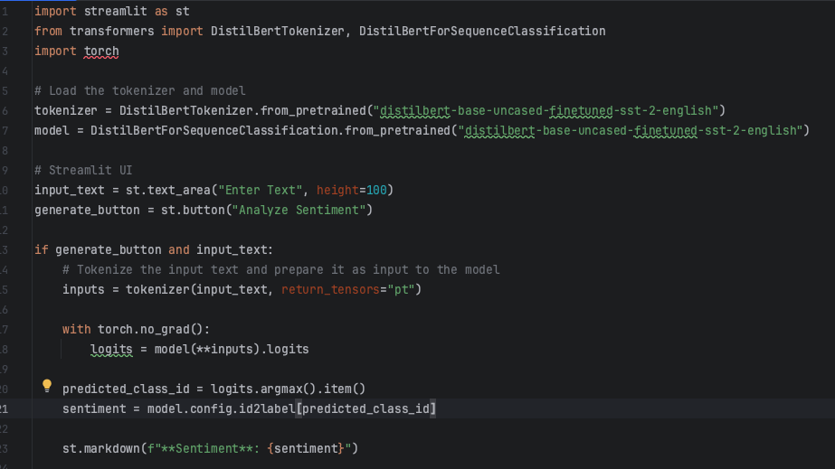
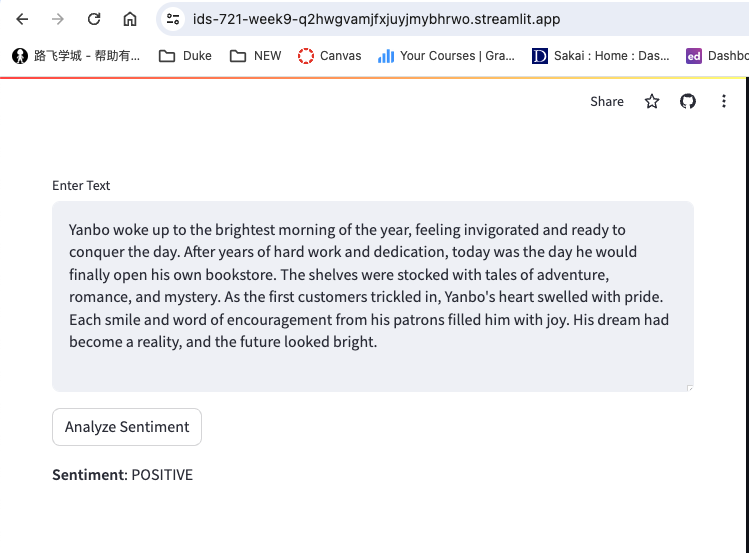
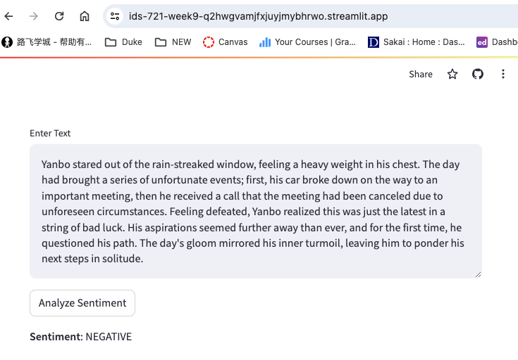

# yg229_mini_project_9
This Sentiment Analysis App is built using Streamlit, PyTorch, and the Hugging Face Transformers library. It leverages the distilbert-base-uncased-finetuned-sst-2-english model for analyzing the sentiment of input text. Users can enter any text into the app, and it will classify the sentiment as either positive or negative. This tool is particularly useful for quickly gauging sentiments in customer feedback, reviews, or any textual data that requires sentiment analysis.

## Author

Yanbo Guan

## Demo Link
[Link](https://ids-721-week9-q2hwgvamjfxjuyjmybhrwo.streamlit.app/)

## Features
- Text Input: Users can input any text they wish to analyze.
- Sentiment Analysis: Utilizes a pre-trained DistilBERT model fine-tuned on the SST-2 dataset for accurate sentiment classification.
- Real-time Analysis: The app quickly processes input text and outputs the sentiment, making it efficient for real-time analysis.
- User-friendly Interface: Built with Streamlit, the app offers an intuitive and easy-to-navigate interface.

## app.py


## Deploy steps
1. Enter the following link [https://share.streamlit.io/](https://share.streamlit.io/), sign up an account
2. Creat an account and link to your Github
3. Create a repo, add ```app.py``` and ```requirements.txt``` to it
4. Create new app on streamlit website, check the log through the bottom right corner
5. Perform the test.

## Test steps:
1. Positive sentiment test example: ```Yanbo woke up to the brightest morning of the year, feeling invigorated and ready to conquer the day. After years of hard work and dedication, today was the day he would finally open his own bookstore. The shelves were stocked with tales of adventure, romance, and mystery. As the first customers trickled in, Yanbo's heart swelled with pride. Each smile and word of encouragement from his patrons filled him with joy. His dream had become a reality, and the future looked bright.```
2. Negative sentiment test example: ```Yanbo stared out of the rain-streaked window, feeling a heavy weight in his chest. The day had brought a series of unfortunate events; first, his car broke down on the way to an important meeting, then he received a call that the meeting had been canceled due to unforeseen circumstances. Feeling defeated, Yanbo realized this was just the latest in a string of bad luck. His aspirations seemed further away than ever, and for the first time, he questioned his path. The day's gloom mirrored his inner turmoil, leaving him to ponder his next steps in solitude.```
## Results:

